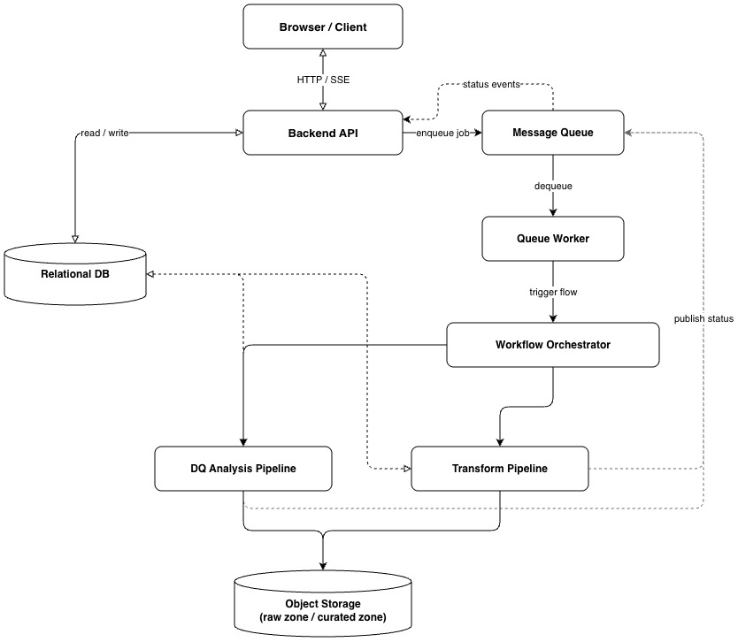
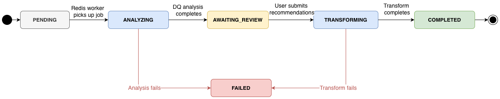
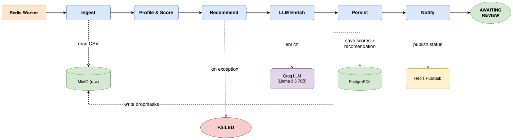
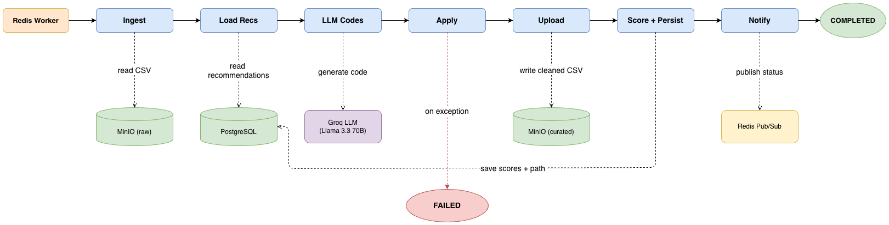
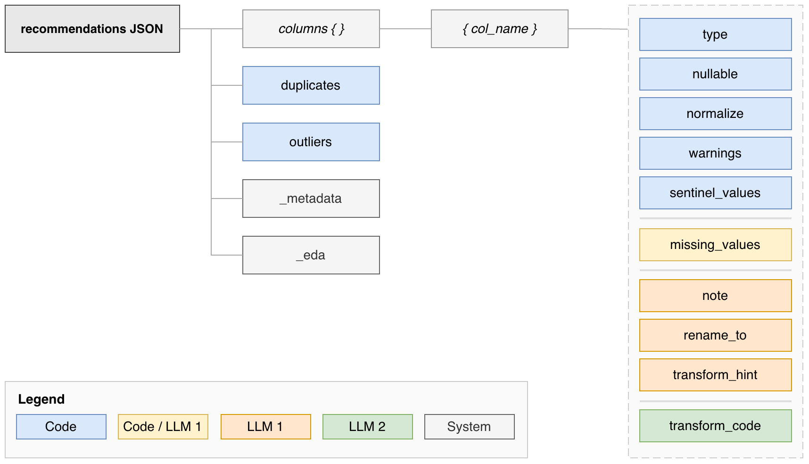

# Data Quality Engineering Pipeline

Automated data quality analysis and transformation system. Upload a CSV, get scored recommendations enriched with LLM reasoning, review and edit them, apply transformations, download the cleaned file.



---

## How It Works

1. **Upload** a CSV file (up to 200 MB)
2. **Analysis** runs automatically — profiles every column, scores quality across 4 dimensions, generates structured recommendations, enriches them with Groq LLM reasoning
3. **Review** the recommendations in the UI — edit strategies, adjust outlier handling, check drop impact
4. **Submit** — transformations are applied in a fixed, auditable order
5. **Download** the cleaned CSV and compare before/after DQ scores

### Run Status Lifecycle



---

## Features

- **4-dimensional DQ scoring** — completeness, uniqueness, validity, consistency; stored before and after every transform
- **Deterministic recommendations** — missing value strategy (MCAR/MAR/MNAR-aware), type casting, duplicate removal, outlier detection (IQR), sentinel detection, normalisation
- **LLM enrichment** — Groq + Llama 3.3 70B adds semantic reasoning: MNAR leave_null detection, column rename suggestions, domain notes, custom transform hints for format issues
- **Custom transforms** — LLM generates AST-validated pandas lambdas from plain-English hints; rolled back on damage
- **EDA dashboard** — DQ radar chart, missing heatmap, histogram grid, box plots, categorical frequency bars
- **Drop impact** — precomputed bitsets give exact row counts as you edit strategies
- **Human review gate** — no change is applied without explicit approval
- **Live status** — server-sent events push status updates to the browser; no polling needed
- **Multi-user** — JWT auth, per-user isolation, file history and run restarts

---

## Tech Stack

| Layer | Technology |
|---|---|
| Frontend | React + Vite + TypeScript + Tailwind CSS v4 |
| API | FastAPI (async) |
| Auth | JWT + Argon2 |
| Orchestration | Prefect 3 |
| Job queue | Redis (LPUSH / BRPOP) |
| Database | PostgreSQL 16 (JSONB for scores + recommendations) |
| Object storage | MinIO (raw zone + curated zone) |
| LLM | Groq — Llama 3.3 70B |

---

## Pipelines

### DQ Analysis Flow



### Transform Flow



---

## Recommendations Schema



Every column gets one dict. Blue fields are set by deterministic code; orange by LLM 1; green by LLM 2.

```json
{
  "columns": {
    "salary": {
      "type": "float",
      "nullable": true,
      "missing_values": {"strategy": "median", "value": null},
      "normalize": "z_score",
      "warnings": ["drop_row would remove 42 rows (3.5%)"],
      "note": "Right-skewed — median is more robust than mean here.",
      "sentinel_values": [-999.0],
      "rename_to": "annual_salary_usd",
      "transform_hint": null,
      "transform_code": null
    }
  },
  "duplicates": {"strategy": "drop", "subset": [], "keep": "first"},
  "outliers": {
    "salary": {"count": 3, "method": "iqr", "lower": 42000.0, "upper": 158000.0, "strategy": "winsorise"}
  },
  "_metadata": {"generated_at": "...", "dq_score": 67.4},
  "_eda": {"total_rows": 1200, "total_columns": 14, "columns": {"salary": {"...": "..."}}}
}
```

---

## Quick Start

### Prerequisites

- Docker + Docker Compose
- A free [Groq API key](https://console.groq.com/) (optional — falls back to deterministic-only without it)

### 1. Clone

```bash
git clone [https://github.com/Gofka81/DQ_engineering_pipeline](https://github.com/Gofka81/DQ_engineering_pipeline)
cd DQ_engineering_pipeline
```

### 2. Configure

Linux / macOS:
```bash
cp .env.example .env
```

Windows:
```cmd
copy .env.example .env
```

Open `.env` and set:
- `LLM_API_KEY` — your Groq key (leave empty to skip LLM enrichment)
- If running on a remote machine, update the three IP-based URLs (see comments in `.env.example`)

`SECRET_KEY` — a random string used to sign JWT tokens. The default value in `.env.example` is fine for local testing; change it for any deployment accessible over a network. 
To generate a strong key:

Linux / macOS: 
```bash
openssl rand -hex 32
```

Windows:
```cmd
python -c "import secrets; print(secrets.token_hex(32))"
```

### 3. Start

```bash
docker compose up -d
```

On first start the prefect-worker registers both flow deployments (~30 s). Check it's ready:

```bash
docker compose logs -f prefect-worker
# wait for: Deployment 'dq-analysis' registered
#           Deployment 'transform' registered
```

### 4. Web interfaces

| Service | URL |
|---|---|
| Frontend | http://localhost:3000 |
| API docs | http://localhost:8020/docs |
| Prefect UI | http://localhost:4200 |
| MinIO console | http://localhost:9001 |

Register an account, upload a CSV, and follow the flow.

---

## Running on a Remote Machine

When running on a server or any machine accessed over the network, update three values in `.env` before starting — replace `localhost` with the machine's IP:

```bash
MINIO_PUBLIC_ENDPOINT=http://<machine-ip>:9000
VITE_API_URL=http://<machine-ip>:8020
PREFECT_UI_API_URL=http://<machine-ip>:4200/api
```

Then rebuild the frontend so the new API URL is baked into the bundle:

```bash
docker compose up -d --build frontend
```

---

## DQ Score Formula

| Dimension | Weight | Calculation |
|---|---|---|
| Completeness | 35% | `(1 − missing_cells / total_cells) × 100` |
| Uniqueness | 25% | `(1 − duplicate_rows / total_rows) × 100` |
| Validity | 25% | `(type-conforming cells / total_cells) × 100` |
| Consistency | 15% | `(pattern-matching cells / total_cells) × 100` |

---

## Project Structure

```
├── backend/app/
│   ├── api/            # auth.py, files.py — all REST endpoints
│   ├── core/           # config, JWT, MinIO client, Redis client
│   ├── db/             # asyncpg pool, User/File/Run models
│   └── schemas/        # Pydantic request/response models
│
├── prefect/
│   ├── flows/
│   │   ├── dq_logic.py          # pure business logic — profile, score, recommend, apply
│   │   ├── llm_enrichment.py    # Groq runner, validator, transform code generator
│   │   ├── dq_flow.py           # Prefect task wrappers for DQ analysis
│   │   ├── transform_flow.py    # Prefect task wrappers for transform
│   │   └── common.py            # shared utilities (publish_status, logging)
│   ├── tests/
│   │   ├── test_dq_logic.py
│   │   └── test_llm_enrichment.py
│   ├── redis_worker.py          # BRPOP worker → triggers Prefect deployments
│   └── prefect.yaml
│
├── frontend/src/
│   ├── pages/          # MainPage, HistoryPage
│   ├── components/     # RecommendationsEditor, EDADashboard, charts, ...
│   ├── hooks/          # useRunEvents (SSE), useAuth, useTheme
│   └── api/            # typed API client functions
│
├── init.sql            # DB schema
├── docker-compose.yaml
└── .env.example
```

---

## Running Tests

```bash
python3 -m venv .venv
.venv/bin/pip install -r prefect/requirements.txt

.venv/bin/python3 -m pytest prefect/tests/test_dq_logic.py -v
.venv/bin/python3 -m pytest prefect/tests/test_llm_enrichment.py -v
```

All tests must pass before committing changes to `dq_logic.py` or `llm_enrichment.py`.

---

## Useful Commands

```bash
# Rebuild after code changes
docker compose up -d --build prefect-worker   # flow changes
docker compose up -d --build backend          # API changes
docker compose up -d --build frontend         # UI changes

# Logs
docker compose logs -f prefect-worker
docker compose ps

# Clean slate (destroys all data)
docker compose down -v
```
